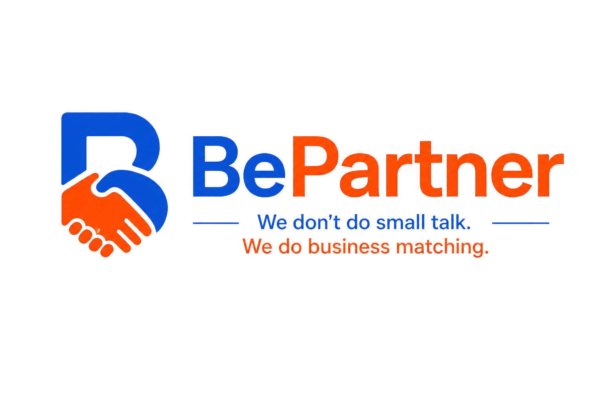

  

  <h1>BePartner</h1>

  
<em>Business matching for Thailand. No expo required.</em>

  

    
    
    
    
    
  

---

## What is BePartner?

BePartner is an early-stage B2B business matching platform built for Thailand.

It helps Thai SMEs and corporate buyers find relevant partners, suppliers, and buyers — without relying on expensive trade expos, lost business cards, cold emails, or messy spreadsheets.

The platform is intentionally simple at this stage. The goal is to prove that Thai businesses want this — and then grow from there.

---

## The Problem

Thai business matching is still manual, slow, and gatekept by existing relationships. Thai SMEs outside Bangkok are invisible to the corporate buyers who would actually want their products. There is no affordable, always-on, digital way for Thai businesses to find each other.

BePartner is infrastructure to close that gap.

---

## How It Works

1. A business creates a profile
2. They add their industry, location, tags, and what they are looking for
3. They browse and search other businesses by industry and tags
4. BePartner shows a simple match score based on profile overlap
5. A user sends a connect request
6. Contact details are revealed only when both businesses accept

---

## MVP Scope

**What's in v1:**
- Business signup and profile creation
- Browse and search by industry, tags, and location
- Simple tag-overlap match score
- Mutual connect request flow
- Contact reveal after both sides accept
- Thai and English language support

**Future possibilities** *(only after real demand is validated)*:
- Opportunity posting board
- Meeting scheduler
- Verified business badges
- Event and organizer tools
- Advanced matching logic

---

## Stack

- **Frontend** — Next.js, React, TypeScript
- **Styling** — Tailwind CSS
- **Backend** — Supabase (Auth, Database, Storage)
- **Hosting** — Vercel

> 🔧 Stack subject to change as the project grows — learning while building.

---

## Developer

Built by **Francis** — a BBA graduate teaching himself full-stack development by shipping a real product.

See [CHANGELOG.md](./CHANGELOG.md) for full version history.
 
---

## Project Status — 🟡 Early Access · Active Development 

BePartner is currently in early access and active development.

Expect rapid iteration, broken things, fixed things, and constant improvement.

---

  
Built in Thailand 🇹🇭

  
<em>Business matching. No expo required.</em>

